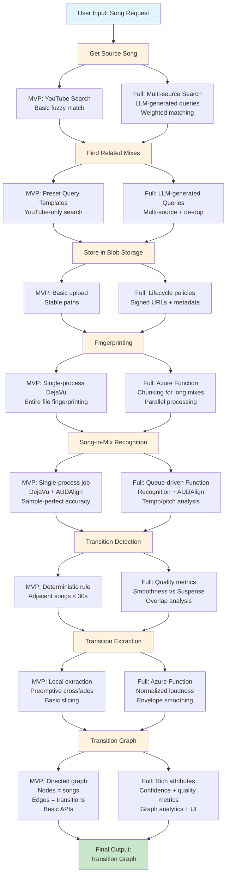

# Auto DJ – End-to-End Pipeline (MVP vs Full)

This document organizes each stage of the pipeline into **MVP** (fastest path to demo) and **Full** (scaled/robust version).

---

## 1. **Get the Source Song**

**MVP**

- Use **YouTube-only** search via `yt-dlp`.
- Basic fuzzy match on title + artist; pick top result.
- Download as provided; convert to MP3/MP4A if necessary (local FFmpeg).

**Full**
- **Multi-source search** (YouTube, SoundCloud, etc.) using `yt-dlp` URL prefixes.

- Finding remixes of each song, sometimes djs will use remixes of the songs 
  - same way that we can swipe through transitions what if we could swipe through remixes
  - or for example if group all remixes together then we could now possibly find new transitions which were previously impossible due to the remixes being different enough that they weren't recognizable with our fingerprints.
  - this does not sound feasible for the hackathon

---

## 2. **Find Related Mixes**

**MVP**

- Use **preset query templates** (e.g., `"<song> <artist> DJ mix"`, `"<genre> mix"`, `"<song> megamix"`).
- Search **YouTube-only** with `yt-dlp` and download top-N results.
- Simple de-dup by title string match.
- limit max duration in order to avoid having to split up audio files for the azure functions fingerprinting later (if we do the splitting then we can remove the limit)

**Full**
- multi-source like above
- Asking the LLM for queries that would involve more than just one song (whether that's one to one transitions or just hey here's the playlist try to find queries that would return mixes which contain these songs)
- storing all queries to prevent duplicate searches
  - two different reggaeton songs might have the llm say top 50 reggaeton mix but we don't need to search it twice
- Have an llm specifically ask for queries that would contain the songs in the entire playlist.
- Weighted fuzzy matching (title, artist, duration, channel reputation, upload type) with tie-breakers.
- Rate-limit + backoff + caching of search results.

---

## 3. **Store in Blob**

**MVP**

- **Required** from day one: upload song & mixes to **Azure Blob Storage** with stable paths (e.g., `/songs/{spotify_id}/original.*`, `/mixes/{hash}/raw.*`).

**Full**

- Lifecycle policies (hot → cool → archive), content hashes, and integrity checks.
- Signed URLs, per-file metadata (codec, duration, source URL, search query id).

---

## 4. **Fingerprinting**

**MVP**

- Fingerprint the **entire file** end-to-end using **DejaVu** in the same process after download; write fingerprints to Postgres/file store; mirror to Blob/DB.

**Full**

- **Azure Function** (blob-trigger) fetches file → runs DejaVu → persists (DB + Blob).
- **Chunking for long mixes:** split large files (e.g., >20–30 min) into fixed-length segments (e.g., 3–5 min) with small overlap (e.g., 5–10s) to preserve matches across boundaries; process segments **in parallel** to normalize function run time and avoid stragglers.
- Optional multi-song batching per invocation is **not required** (Function cold-start/startup overhead is minor); prefer per-mix/per-chunk fan-out via a queue.
- Parallelism controls, observability (logs/metrics), retries.

---

## 5. **Song-in-Mix Recognition**

**MVP**

- **Single-process job**: after all fingerprints are ready, run DejaVu recognition over each mix, emitting rough offsets for detected songs.
- Run **AUDAlign** after DejaVu recognition to refine offsets to **sample-perfect** accuracy.
- analyze the density of the spectral peak matching to find the point where starts matching and where it no longer matches, these are the start and stop points of our song within the mix (check if dejavu or AUD align does that already or not)

**Full**

- Queue-driven **Azure Function** per mix (or shard) that performs recognition and writes offsets and confidence to DB.
- determine if the recognition had any tempo or pitch changes and plan/annotate accordingly
  - at first can just mark as invalid transition
  - later can use dtw (dynamic time warp) or similar to actually take care of the problem

---

## 6. **Transition Detection**

**MVP**

- Deterministic rule: for adjacent detected songs in a mix, if `next.start - prev.end ≤ MAX_TRANSITION_TIME` (e.g., 30s), record a **transition**.

**Full**

- honestly this should probably be enough

- Watch out for two songs which are supposedly in the same spot on the mix, could indicate the possibility of duplicate audio or remixes that are close enough to be counted as the same

- **Smoothness vs. Suspense Metric**

  - Describes whether the transition feels like a **sudden beat drop** or a **seamless blend** that is almost unnoticeable.
  - **Overlap length**: how long the two songs play simultaneously.
  - **RMS/energy dip**: whether there is a brief drop in loudness, often used to create space for a transition.
  - **Spectral flux**: how quickly the frequency content changes; spikes often indicate dramatic shifts such as beat drops or cuts.

---

## 7. **Transition Extraction**

**MVP**

- **Local** extraction: slice the mix around the boundary.
- **Preemptive crossfades**:
  - Fade-in from the original **previous** track into the mix snippet.
  - Fade-out from the snippet into the original **next** track.
- Save transition chunks to Blob; store metadata in DB.
- make sure to hace 2-5ms microfades at edges to avoid clicks

**Full**

- **Azure Function** per transition (queue-trigger) performs slicing and crossfades (FFmpeg), respecting existing mix overlaps.
- Normalized loudness (EBU R128 target), envelope smoothing, and edge-case guards (very short/long transitions).

---

## 8. **Transition Graph**

**MVP**

- Build a **directed graph** in DB: **nodes = songs**, **edges = transitions** with timestamps, source mix id, and simple confidence.
- Basic APIs to fetch neighbors/out-edges for a song.

**Full**

- Rich edge attributes: confidence, overlap length, tempo/key compatibility, quality metrics.
- Indexes for fast neighbor queries, graph analytics, and pathfinding.
- Admin UI for inspecting transitions and audio previews.

---

## Deployment/Scaling Roadmap

1. Start local  as single-process jobs.
   1. Most of these steps are independent modules with clear inputs and outputs. You can develop them in parallel, provided each step assumes that the previous ones worked correctly and supplies valid input. Use placeholder or fake data for testing until real inputs are available.
2. Enhance search (multi-source + LLM), quality scoring, and graph features.
3. Migrate heavy tasks to **Azure Functions** with queues: fingerprinting, recognition, extraction.
4. Steps 2 and 3 sf can be done in parallel by different people
5. Add reliability (retries, poison queues), observability, and lifecycle policies.

---

## Summary

- **MVP**: YouTube-only search, preset mix queries, local processing (fingerprint/recognize/extract), Blob as storage, simple transition rule, minimal graph.
- **Full**: Multi-source search + LLM queries, Azure Functions with queues and retries, advanced de-dup + normalization, transition quality metrics, and a fully indexed transition graph with APIs/UI.

---

## Pipeline Visualization

